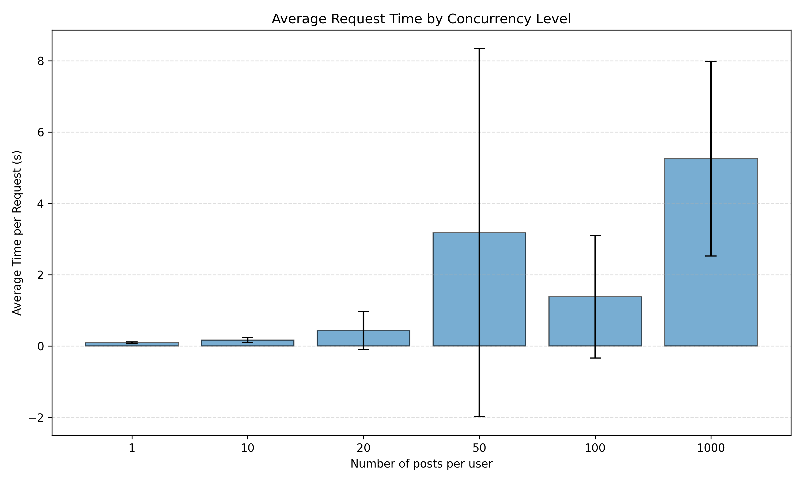
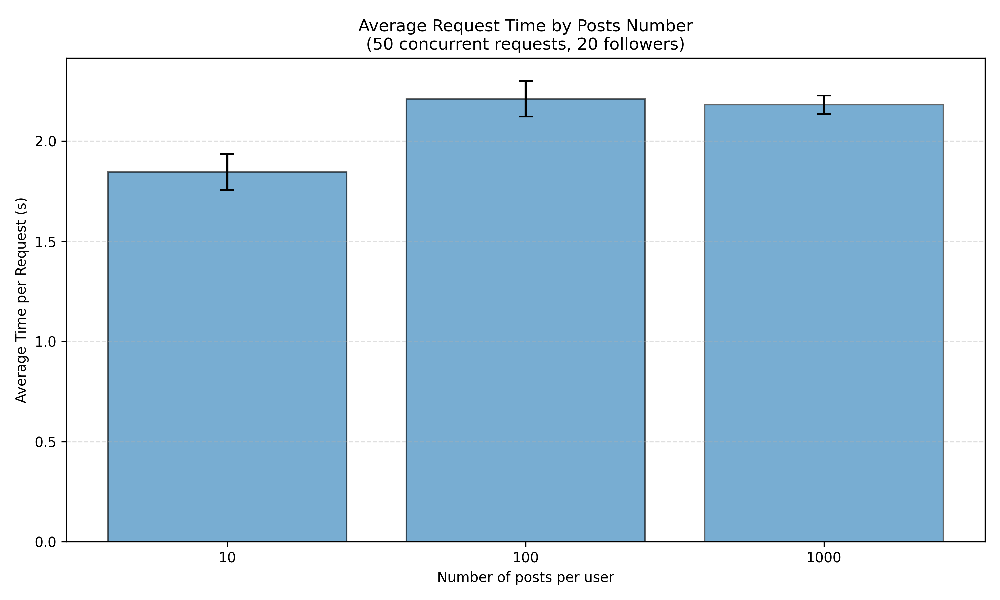
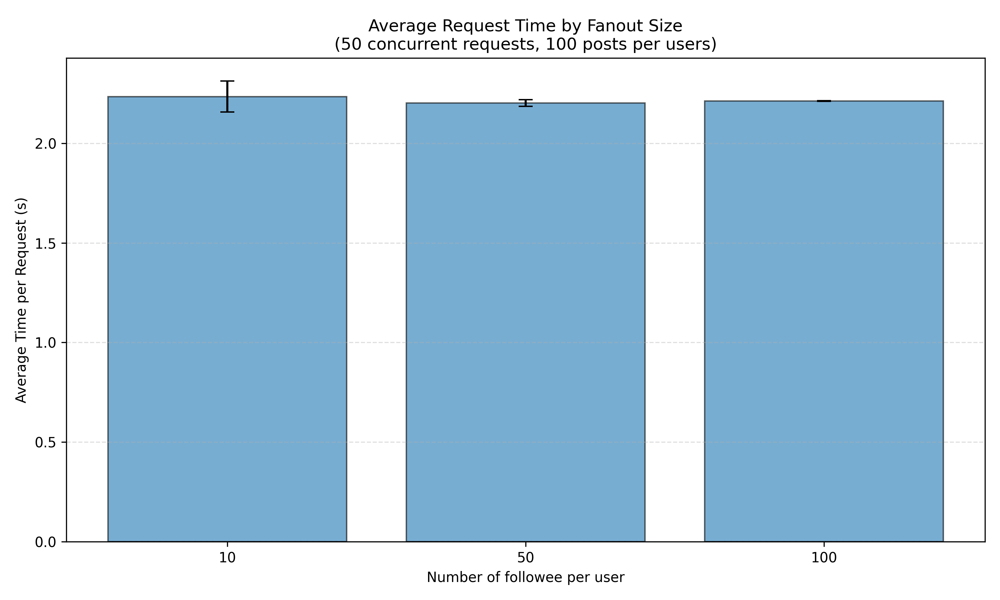

# Massive_data_project

##Lien vers l'application déployée : 

##Résultats :
###Barplot pour la concurrence
Avec 1000 utilisateurs, 50 posts par utilisateur et 20 followers random par utilisateur. 
Temps d'exécution moyen d'une requête timeline (ms) pour 1, 10, 20, 50, 100, 1000 utilisateurs distincts simultanés.

###Barplot en faisant varier le nombre de posts :
Avec 50 utilisateurs et 20 followers random par utilisateur, 50 requêtes simultanées.
Temps d'exécution moyen des requêtes timeline (ms) pour 10, 100, 1000 posts par utilisateur.

###Barplot en faisant varier le nombre de followee : 
Avec 50 utilisateurs, 50 requêtes simultanées et 100 posts par utilisateur.
Temps d'exécution moyen des requêtes timeline (ms) pour 10, 50, 100 followee par utilisateur.

